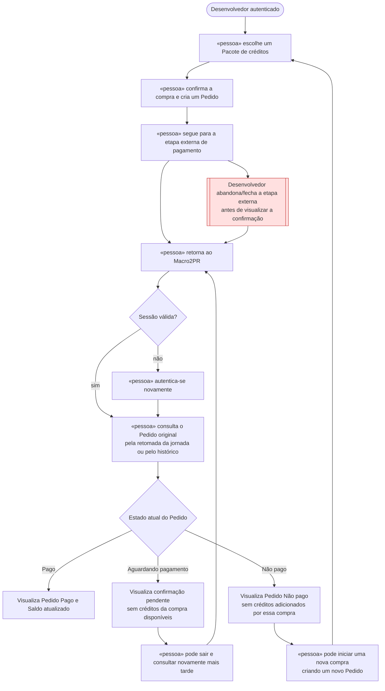

# 🗺️ Jornadas de Usuário

**Projeto:** Macro2PR
**Versão:** 1.0.0
**Última atualização:** 2026-09-11

> 🤖 **Este documento é a fonte da verdade sobre O QUE A PESSOA VIVE na tela** —
> o caminho do primeiro clique até o objetivo, e principalmente os pontos onde ela
> trava, espera ou desiste.
>
> ✍️ **Não preencha na mão:** rode `/utf-flows`. A entrevista escolhe a história que
> merece o desenho, obriga o ponto de desistência a aparecer e cobra a decisão sobre
> ele.
>
> 🚫 **Não duplique:** regra de negócio mora no `prd.md`; estado, entidade e contrato
> moram no `architecture.md`. Aqui mora o caminho.

---

## Jornada 1 — Compra e pagamento de créditos

**Stories:** US11, US12 e US13.
**Critérios que ela marca:** sai do site e volta · depende do tempo · depende de confirmação externa · pode ser abandonada.

**O que decidimos sobre o nó vermelho:**

Se o Desenvolvedor fechar a etapa externa de pagamento, perder a conexão ou retornar depois, o Pedido permanece registrado e o retorno ao Macro2PR não libera créditos nem repete o pagamento. Ao voltar, ele consulta o Pedido original e visualiza seu estado atual: Pago, com o Saldo atualizado; Aguardando pagamento, enquanto a confirmação ainda não chegou; ou Não pago, sem créditos adicionados. Se a sessão tiver expirado, ele se autentica novamente antes de retomar o Pedido. A ausência de confirmação não é tratada como falha: enquanto não houver uma informação confiável sobre o pagamento, o Pedido continua aguardando. Para tentar uma nova compra após um Pedido Não pago, é necessário criar um novo Pedido.

---

## Dúvidas em aberto

| # | Dúvida | Onde ela precisa ser resolvida |
| --- | --- | --- |
